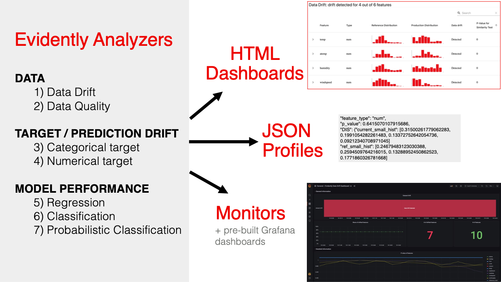

# Evidently AI

[Evidently AI](https://evidentlyai.com/) is an open-source Python library for data scientists and ML engineers. It helps evaluate, test and monitor the performance of ML models from validation to production.

## Dataset

Download dataset: <https://www.kaggle.com/datasets/gabrielsantello/lending-club-loan-preprocessed-dataset>

A subset of the LendingClub DataSet obtained from Kaggle: <https://www.kaggle.com/wordsforthewise/lending-club>. LendingClub is a US peer-to-peer lending company, headquartered in San Francisco, California. It was the first peer-to-peer lender to register its offerings as securities with the Securities and Exchange Commission (SEC), and to offer loan trading on a secondary market. LendingClub is the world's largest peer-to-peer lending platform.

Given historical data on loans, predict whether the borrower defaulted (`Charged Off`) or not (`Fully Paid`).

**Target Column** : 1 column `loan_status`
**Features Columns**: 26 columns excluding `loan_status`

## Evidently Dashboard

Evidently Dashboard can be used to compare two datasets in different scenarios.

### Input data

In Evidently, the two input data are referred as "Reference" and "Current" datasets.

1. The first dataset is the reference. This can be training or earlier production data that serves as a baseline for comparison.
2. The second dataset is current. It can include the recent production data.

For example:

- **Training vs Test** : Training dataset is "Reference" and test dataset is "Current"

- **Production vs Training** : Training dataset is "Reference" and production dataset is "Current"

- **Current performance vs Past** : Pass the earlier data as "Reference", and newer data as "Current".

### Reports, Dashboard and Profiles

Evidently provides different ways to visualize aspects of data and model performance using pre-built Reports. An interactive visual Dashboard can be displayed inside the Jupyter notebook.

- `DataDriftTab` to estimate the data drift
- `DataQualityTab` to provide a detailed dataset overview
- `NumTargetDriftTab` to estimate target drift for the numerical target (for problem statements with the numerical target function: regression, probabilistic classification or ranking, etc.)
- `CatTargetDriftTab` to estimate target drift for the categorical target (for problem statements with the categorical target function: binary classification, multi-class classification, etc.)
- `RegressionPerformanceTab` to explore the performance of a regression model.
- `ClassificationPerformanceTab` to explore the performance of a classification model.
- `ProbClassificationPerformanceTab` to explore the performance of a probabilistic classification model and the quality of the model calibration.

  

Expected data schema is different depending on report type.

- For the **Data Drift** report, include the input features only.
- For the **Target Drift** reports, include the input features and Target and/or the Prediction column.
- For the **Model Performance** reports, include the input features, Target, and Prediction.

Evidently also supports **Profiles**, which are "JSON versions" of the Evidently dashboards. JSON profiles are useful for storing and logging, providing further analysis

### Integrations

Evidently also provides integration with other tools in ML pipeline.

- [Evidently with Grafana and Prometheus](https://docs.evidentlyai.com/integrations/evidently-and-grafana)

- [Evidently with MLflow](https://docs.evidentlyai.com/integrations/evidently-and-mlflow)

- [Evidently with Airflow](https://docs.evidentlyai.com/integrations/evidently-and-airflow)
